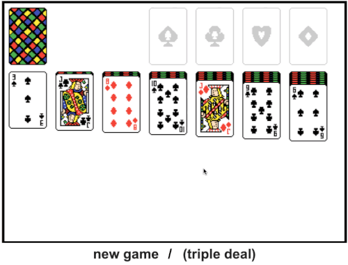

# web-solitaire
A Solitaire implementation written in Javascript to be loaded into an HTML5 canvas. Requires the use of two HTML buttons for toggling deal type and triggering new games.
  

  

A playable version can be found [here](https://www.strdavis.com/solitaire/).
   

Web Solitaire is licensed under the MIT license.

Copyright © 2020 Spencer Davis
